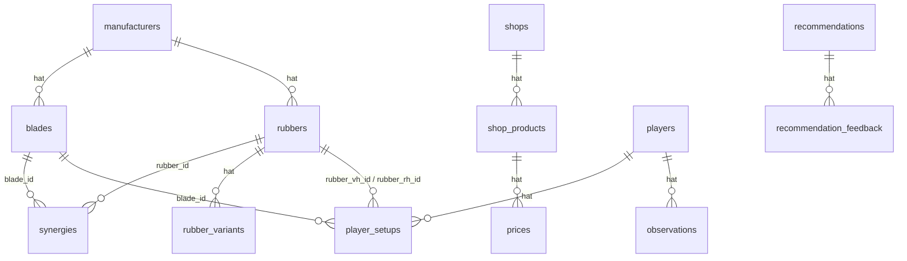

# PongSmith — Datenbank-Schema

**Stand:** Phase 1.3 | Dialect: PostgreSQL (Supabase, Frankfurt)

---

## ER-Diagramm



---

## Tabellen-Übersicht

### Stammdaten Material

| Tabelle | Beschreibung |
|---|---|
| `manufacturers` | Hersteller (Butterfly, Stiga, Donic, …) |
| `blades` | Hölzer mit normierten + Community-Werten |
| `rubbers` | Beläge mit normierten + Community-Werten |
| `rubber_variants` | Dicke/Härte-Varianten eines Belags |

### Empfehlungs-Engine

| Tabelle | Beschreibung |
|---|---|
| `synergies` | Paarweiser Synergie-Score Holz × Belag (0–100) |

### Shop & Preise

| Tabelle | Beschreibung |
|---|---|
| `shops` | Shop-Stammdaten + Affiliate-Info |
| `shop_products` | URL-Mapping PongSmith-Produkt → Shop |
| `prices` | Tägliche Preis-Snapshots (per Scraping) |

### Erfahrungs-DB

| Tabelle | Beschreibung |
|---|---|
| `players` | Anonymisierte Vereinsspieler |
| `player_setups` | Aktuelles + vergangene Setups je Spieler |
| `observations` | Stärken/Defizite/Empfehlung je Spieler |

### KI-Tracking

| Tabelle | Beschreibung |
|---|---|
| `recommendations` | Gespeicherte KI-Empfehlungen (JSONB) |
| `recommendation_feedback` | Nutzer-Feedback (gut/mittel/schlecht) |

---

## Normalisierungs-Regeln

Hersteller verwenden unterschiedliche Skalen (Butterfly 1–13+, Donic 1–10, etc.).
Alle Werte werden auf **1.0–10.0** normiert:

```
speedNorm = (speedRaw / speedRawScale) * 10
```

Community-Werte von revspin.net werden separat gespeichert und ebenfalls normiert.
Der Synergie-Score kombiniert normierte Werte beider Quellen.

---

## Synergie-Berechnung

Wird in `lib/synergy.ts` implementiert (Phase 1.7).
Eingabe: `blade_id` + `rubber_id`
Ausgabe: Score 0–100 plus 5 Teilscores.

Ein Setup-Score für Holz + VH-Belag + RH-Belag ergibt sich aus zwei paarweisen Synergie-Scores:
`setupScore = (synergy(blade, rubber_vh) + synergy(blade, rubber_rh)) / 2`
